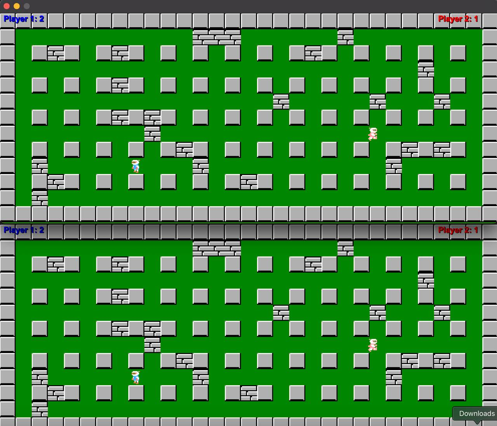

# **CN_CA1 - Online Bomberman**



## Questions

### 1.

A socket is a software tool that allows two devices to communicate over a network. It helps programs send and receive data. In this project, both TCP and UDP sockets are used to handle communication between the server and the client.

#### Example from the code:
In the `ServerManager` class, a TCP socket is used to manage communication between the server and the client:
```cpp
void ServerManager::setupServer(ushort port) {
    _server = new QTcpServer(this);
    _server->listen(QHostAddress::Any, port);
    connect(_server, &QTcpServer::newConnection, this, &ServerManager::clientJoined);
}
```
Here, the server opens a TCP socket on a specific port and waits for a client to connect.

For UDP, the socket is used in the `UDPManager` class:
```cpp
UDPManager::UDPManager(int selectedPlayer, QObject *parent) : QObject(parent), udpSocket(new QUdpSocket(this)) {
    quint16 port = (selectedPlayer == 1) ? 12345 : 12346;
    udpSocket->bind(port);
}
```
This UDP socket is used to send and receive data between players.

---

### 2. 

- **TCP**: TCP is connection-based, meaning it ensures data is delivered in the correct order and without loss. It’s great for situations where reliability is important, like file transfers or messaging.
- **UDP**: UDP is connectionless, meaning it doesn’t guarantee data delivery or order. It’s faster than TCP and works well when speed is more important than reliability, like in games or video streaming.

#### Example from the code:
In your project, TCP is used for reliable communication between the server and the client:
```cpp
void ServerManager::handleServerEvent(QKeyEvent *event) {
    QByteArray data;
    QDataStream stream(&data, QIODevice::WriteOnly);
    stream << event->type();
    stream << event->key();
    _socket->write(data);
}
```
Here, key events are sent from the server to the client using TCP to ensure they are delivered correctly.

For UDP, data is sent quickly without worrying about delivery guarantees:
```cpp
void UDPManager::sendData(const QByteArray &data, int selectedPlayer) {
    QHostAddress address = QHostAddress("127.0.0.1");
    quint16 port = (selectedPlayer == 1) ? 12346 : 12345;
    udpSocket->writeDatagram(data, address, port);
}
```
This is used to send data between players with low latency.

---

### 3.

- **TCP is better**:
  - When you need to make sure data is delivered.
  - When the order of data matters.
  - For things like file transfers, emails, or messaging.

- **UDP is better**:
  - When speed is more important than reliability.
  - When losing some data is okay.
  - For things like online games, video streaming, or voice calls.

#### Example from the code:
In this project, TCP is used for reliable communication between the server and client:
```cpp
void ServerManager::receiveFromClient() {
    QByteArray data = _socket->readAll();
    QDataStream stream(&data, QIODevice::ReadOnly);
    QEvent::Type type;
    int key;
    stream >> type >> key;
    QKeyEvent *_event = new QKeyEvent(type, key, Qt::NoModifier);
    emit clientEventReceived(_event);
}
```
Here, data is received from the client and processed reliably.

UDP is used for fast communication between players:
```cpp
void Game::sendPlayerMovement(int key, bool status) {
    QByteArray data;
    QDataStream stream(&data, QIODevice::WriteOnly);
    stream << QChar('M') << key << status;
    emit dataReady(data, selectedPlayer);
}
```
This sends player movement data quickly, even if some packets are lost.

---

### 4.

UDP is commonly used in real-time multiplayer games because it’s faster and has lower latency than TCP. In games like Bomberman, losing a few packets is okay because the game state is constantly updated. This makes UDP perfect for keeping the game smooth and responsive.

#### Example from the code:
In this project, UDP is used to send player movement and bomb placement data:
```cpp
void Game::sendBomb() {
    QByteArray data;
    QDataStream stream(&data, QIODevice::WriteOnly);
    stream << QChar('B') << selectedPlayer;
    emit dataReady(data, selectedPlayer);
}
```
Here, bomb placement data is sent using UDP to ensure low latency.

UDP is also used for periodic map synchronization:
```cpp
void Game::sendMapState() {
    QByteArray data;
    QDataStream stream(&data, QIODevice::WriteOnly);
    QList<QRectF> breakableBlocks = getlocalBlocks();
    stream << QChar('C') << breakableBlocks.size();
    for (const QRectF &rect : breakableBlocks)
        stream << rect.x() << rect.y() << rect.width() << rect.height();
    emit dataReady(data, selectedPlayer);
}
```
This ensures that both players stay in sync by periodically sending the map state.

## TCP
Initially, my code has two separate programs on the client and server side. Although the two programs are very similar, this decision was made so that the difference between the two could be seen.

On the server side, a class called Server Manager has been added, and on the client side, a class called Client Manager has been added. In fact, the job of these two classes is to establish communication between the network and the game graphics.

In general, the process of the programs is such that whatever happens on the player side of the server is sent to the client via the network and vice versa, and after receiving the information, the two make updates on their game screens.

The details of these classes and the program process are explained below.
### signals and slots
To communicate between classes, we need to use these two concepts. It is by using these two that we can connect each process in one class to another process in another class. These two play a key role in our project because whatever happens on the network must happen in the game graphics, and also any data that is created on the client or server side must be received on the other side.

**Note that** , in many cases, the server and client side codes are the same, so the codes are shown on one side and the name correspondence is observed on the other side, and if there is a difference, it will definitely be mentioned.So the server-side codes will be shown to you.

```cpp
#server side
# game.cpp
void Game::setupNetwork(){
    connect(players[0],&Player::pressKey,_server,&ServerManager::handleServerEvent);
    connect(_server,&ServerManager::clientEventReceived,players[1],&Player::handleClientEvent);
}
```
In this part, every key pressed from the player side, i.e. the server, is associated with a slot on the server manager side that is called to send this data to the client. Also, every data that is given to the server manager class on the client side over the network is given to a slot of the player class to update its movement on the game.

```cpp
#server side
# ServerManager.cpp
void ServerManager::clientJoined(){
    auto client = _server->nextPendingConnection();
    _socket = client;
    connect(_socket,&QTcpSocket::readyRead,this,&ServerManager::receiveFromClient);
}
```
Also, in this section, any data written to the socket will call a function on the manager server to give it to the player.

### Connections and communicate
This section explains how to connect between the client and the server. As the title suggests, the connection between the two is through the network using the TCP protocol. In this model, the server waits on a specific port from a specific address for clients to connect to it. After connecting, both parties create sockets on a specific port to transfer data and transfer data through them.
```cpp
#server side
#ServerManager.cpp
void ServerManager::setupServer(ushort port){
    _server = new QTcpServer(this);
    _server->listen(QHostAddress::Any,port);
    connect(_server,&QTcpServer::newConnection,this,&ServerManager::clientJoined);
}
```
In this part, the server waits on a specific port to be connected to it.
```cpp
#server side
#ServerManager.cpp
void ServerManager::clientJoined(){
    auto client = _server->nextPendingConnection();
    _socket = client;
    connect(_socket,&QTcpSocket::readyRead,this,&ServerManager::receiveFromClient);
}
```
In this part, after connecting, the server creates a socket to send data to the client.
```cpp
#client side
#ClientManager.cpp
void ClientManager::setupClient(){
    _socket = new QTcpSocket(this);
    _socket->connectToHost(QHostAddress::LocalHost,4500);
    connect(_socket,&QTcpSocket::readyRead,this,&ClientManager::receiveFromServer);
}
```
### Data Transfering
1. Every key pressed by a player must be given to the server administrator to send to the client.
    ```cpp
    #server side
    #player.cpp
    void Player::keyPressEvent(QKeyEvent *event)
    {
        if (m_isDead) { event->ignore(); return; }
        emit pressKey(event);
        if (event->key() == Qt::Key_Space) { placeBomb(); return; }
        updateDirectionState(event->key(), true);
        QGraphicsPixmapItem::keyPressEvent(event);
    }

    void Player::keyReleaseEvent(QKeyEvent *event)
    {
        if (m_isDead) { event->ignore(); return; }
        emit pressKey(event);
        updateDirectionState(event->key(), false);
        QGraphicsPixmapItem::keyReleaseEvent(event);
    }
    ```
    Each time the key is pressed and released, the corresponding signal is called and a slot is called on the server manager side.
2. The server administrator must post what happened on her side to the network so that the client can receive it.
    ```cpp
    #server side 
    #ServerManager.cpp
    void ServerManager::handleServerEvent(QKeyEvent *event){
        if (event->isAutoRepeat()) return;
        QByteArray data;
        QDataStream stream(&data, QIODevice::WriteOnly);
        stream << event->type();
        stream << event->key();
        stream << event->modifiers();
        stream << event->text();
        _socket->write(data);

    }
    ```
    Alternatively, since the class cannot be sent over the network, we can put the class features in a stream and send it, then receive it on the other side, and on the other side, after receiving the stream, we separate it and convert it into a class of interest.

    Auto-repeat is also included so that no data is lost if a key is pressed continuously.
3. Now, any data that is put on the network must be received by the server manager and converted into the desired form.And after receiving it, this data must be directed to the graphics so that the game screen can also be updated.
    ```cpp
    #server side 
    #ServerManager.cpp  
    void ServerManager::receiveFromClient(){
        QByteArray data = _socket->readAll();
        QDataStream stream(&data, QIODevice::ReadOnly);
        QEvent::Type type;
        int key;
        Qt::KeyboardModifiers modifiers;
        QString text;
        stream >> type;
        stream >> key;
        stream >> modifiers;
        stream >> text;
        QKeyEvent *_event = new QKeyEvent(type, key, modifiers, text);
        emit clientEventReceived(_event);
    }
    ```
4. The player in question must get the data from the server administrator and update it on the game screen.
    ```cpp
    #server side
    #player.cpp
    void Player::handleClientEvent(QKeyEvent *_event){
        if(_event){
            if(_event->type() == QEvent::KeyPress){
                keyPressEvent(_event);
            }
            else{
                keyReleaseEvent(_event);
            }
        }
    }
    ```

## UDP

for UDP connect you should only open the server (game.pro) app twice there is no need to client app because the single app controls the server and client concept (which has been explained in TCP part) with simple if conditions.

The project uses UDP for several types of message transfers:
 
### 1. Movement

When a player moves, a movement message (header `M`) is sent. The format is:

- **Header**: `QChar('M')`
- **Key Code**: Indicates which key was pressed or released.
- **Status**: Boolean to indicate press (`true`) or release (`false`).

In the `Game::sendPlayerMovement` method, the UDP message is constructed and sent using the UDPManager.

**Code Snippet: Sending Movement Data**
```cpp
void Game::sendPlayerMovement(int key, bool status) {
    QByteArray data;
    QDataStream stream(&data, QIODevice::WriteOnly);
    stream << QChar('M') << key << status;
    emit dataReady(data, selectedPlayer);
    
    trigOthers();
}
```

### 2. Bombs

When a bomb is placed, a bomb message (header `B`) is sent. The receiving side creates or triggers the bomb placement action.

**Code Snippet: Sending Bomb Data**
```cpp
void Game::sendBomb() {
    QByteArray data;
    QDataStream stream(&data, QIODevice::WriteOnly);
    stream << QChar('B') << selectedPlayer;
    emit dataReady(data, selectedPlayer);
}
```

### 3. Map Synchronization

Since UDP may lose packets, a comprehensive map update is sent after a set number of UDP messages. This update (using header `C`) contains information about all breakable blocks (their positions and dimensions).

#### Sending the Map State

Every N packages (in our case, after 10 messages via the `trigOthers()` method), the game collects the positions of all breakable blocks and sends them as a UDP message.

**Code Snippet: Sending Map State**
```cpp
void Game::sendMapState() {
    QByteArray data;
    QDataStream stream(&data, QIODevice::WriteOnly);
    QList<QRectF> breakableBlocks = getlocalBlocks();
    int blockCounts = breakableBlocks.size();

    stream << QChar('C') << blockCounts;
    for (const QRectF &rect : breakableBlocks)
        stream << rect.x() << rect.y() << rect.width() << rect.height();

    emit dataReady(data, selectedPlayer);
}
```

On the receiving end, the remote map state is validated against the local scene. If the remote map contains fewer breakable blocks, the scene will be updated accordingly.

**Code Snippet: Synchronizing Map State**
```cpp
void Game::syncBlocks(QDataStream &stream) {
    int remoteBlockCount;
    stream >> remoteBlockCount;
    QList<QRectF> remoteBlocks;

    for (int i = 0; i < remoteBlockCount; ++i) {
        qreal x, y, w, h;
        stream >> x >> y >> w >> h;
        remoteBlocks.append(QRectF(x, y, w, h));
    }

    QList<QRectF> localBlocks = getlocalBlocks();

    if (remoteBlockCount < localBlocks.size())
        replaceBlocks(remoteBlocks);
}
```

### 4. Health and Position Updates

Player health (header `H`) and position (header `P`) are also synchronized using similar message structures. These fields are serialized into QDataStream for UDP transmission by the Player class and processed in the Game class.

**Code Snippet: Sending Health Data**
```cpp
void Game::sendHealthes() {
    QByteArray data;
    QDataStream stream(&data, QIODevice::WriteOnly);
    stream << QChar('H');

    for (const QPointer<Player> &player : players)
        stream << player->getPlayerId() << player->getHealth();

    emit dataReady(data, selectedPlayer);
}
```

**Code Snippet: Handling Incoming Player Position Data in Player**
```cpp
void Player::deserializeState(const QByteArray &data) {
    QDataStream stream(data);
    int playerId;
    qreal x, y;
    QChar type;
    stream >> type >> playerId >> x >> y;    

    if (playerId == m_playerId)
        setPos(x, y);
}
```

## Handling Incoming UDP Data

The `UDPManager` listens for incoming UDP datagrams. When data is received, it emits a signal that passes the data to the Game's `processIncomingData` method. Inside this method, the first character of the datagram is inspected to determine the message type (`P`, `B`, `M`, `C`, or `H`), and the data is processed accordingly.

**Code Snippet: UDPManager Receiving Data**
```cpp
void UDPManager::onReadyRead() {
    while (udpSocket->hasPendingDatagrams()) {
        QByteArray buffer;
        buffer.resize(udpSocket->pendingDatagramSize());
        QHostAddress sender;
        quint16 senderPort;

        udpSocket->readDatagram(buffer.data(), buffer.size(), &sender, &senderPort);
        emit dataReceived(buffer, sender, senderPort);
    }
}
```

**Code Snippet: Processing Incoming Data in Game**
```cpp
/SEM6/CN/CA/CN_CA_1/server/src/game.cpp
void Game::processIncomingData(const QByteArray &data) {
    QDataStream stream(data);
    QChar type;
    stream >> type;
    
    if (type == QChar('P')) {
        for (const QPointer<Player> &player : players)
            if (player && player->getPlayerId() != selectedPlayer) {
                player->deserializeState(data);
                break;
            }
    } else if (type == QChar('B')) {
        for (const QPointer<Player> &player : players)
            if (player && player->getPlayerId() != selectedPlayer) {
                player->placeBomb();
                break;
            }
    } else if (type == QChar('M')) {
        syncMovement(stream);
    } else if (type == QChar('C')) {
        syncBlocks(stream);
    } else if (type == QChar('H')) {
        int id, health;
        for (const QPointer<Player> &player : players) {
            stream >> id >> health;
            if (player->getPlayerId() == id)
                player->setHealth(health);
        }
    }
}
```

## Packet Loss Consideration

Because UDP does not guarantee delivery, the game uses periodic comprehensive updates for the map, health, and player positions. The method `trigOthers()` in the Game class monitors the number of UDP messages sent. Once a threshold is surpassed, a full update is transmitted to ensure that both players are in sync with the actual game state.