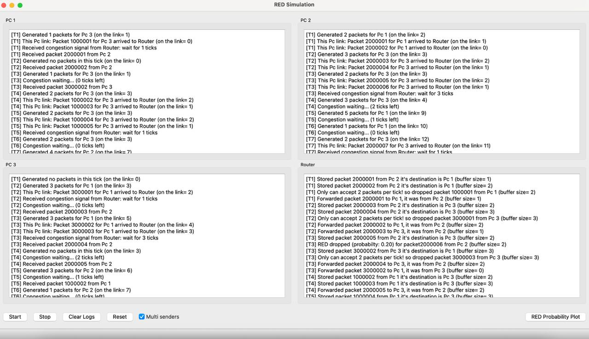
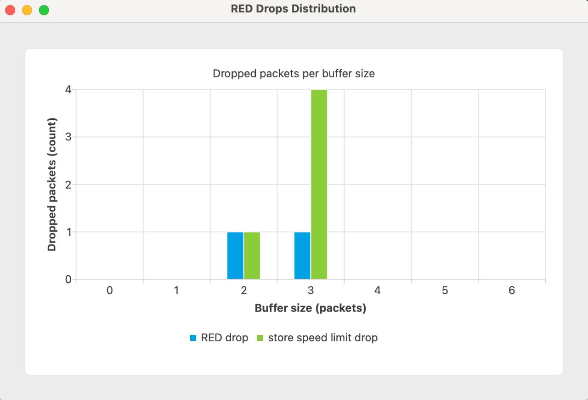

# RED Simulation

```
You should open this project (RED_Simulation.pro) in QT Creator and build and run it in order to use the right version for your OS.
```

This app simulates a small computer network to show how RED (Random Early Drop) algorithm behaves. There are three PCs and one Router. Each PC can send packets to the Router, and the Router forwards them to the destination PC. Time moves in “ticks”. On each tick, one or all 3 PCs can generate packets (base on your choice), they send some of them to the Router, and then the Router forwards some packets (based on which packets are dropped) to the correct receiver.

By opening this app the main window shows four logs: one for each PC and one for the Router. You can start and stop the simulation, clear the logs, reset the whole simulation, select all 3 PCs or one of them (base on chance) send and generate packets in each tick with multi sender checkbox, and open a second window that draws the distribution chart of count RED and speed limit drops based on router's buffer length so far.

Here is a demo of app UI and some important logs beside the distribution chart.


App UI


Distribution Chart

As you can see every thing is working and simulation is correct. (The `[T-number]` in each line means in which tick the action has been happend.)

## How it works

Each tick, the Router resets its per-tick counters.if the multi sender is checked Every PC (PCs order is by chance) otherwise only one of PCs (base on chance) decides how many new packets to create using a Poisson distribution with average 2. Those packets are put into the PC to Router link. A PC can send up to two packets from that Link to the Router on the same tick. The Router tries to accept up to two packets per tick (this is its store speed). If it has already accepted two, it drops more packets by “capacity” and tells the sender to back off for a short random time.

Here we coniderd Link as queue which sotres the packets which are currently in link and each pc link is in its pc node so we don't have an specific class named link.

If the Router still has room to accept in this tick, it applies the RED rule to the current buffer size. The rule is simple and fixed by the assignment:

- p = 0 when buffer size is 0
- p = 0.3\*size − 0.4 for sizes 2 and 3
- p = 1 when size is 4 or more
- otherwise 0

If a random number is under p, the packet is dropped by RED. Otherwise the packet is queued. After that, the Router forwards at most one packet per destination PC (it simulates link speed 1 on each Router to PC link). Packets that are not sent stay in the buffer for the next tick.

The Router records real drop counts in two arrays, one for RED drops and one for capacity drops, each indexed by the buffer size at the moment the drop happened, clamped to 0..6. The chart window reads these arrays and shows how many packets were dropped for each buffer size so far.

## Files and responsibilities

MainWindow owns the UI, buttons, checkbox, and opens the chart window as a separate top-level window. SimulationController owns the Router and three PCs and runs the tick loop. PCNode does both sending and receiving. Router stores, drops, and forwards, and it counts drops by bucket. RedChartWindow draws the grouped bar chart from Router stats. The qmake .pro file pulls in Qt Widgets and Qt Charts.

## Key code

Packets carry who sent them, who should receive them, and when they were created:

```cpp
struct Packet {
    quint64 id;
    int srcId;
    int dstId;
    quint64 createdTick;
};
```

The RED probability function matches the spec exactly:

```cpp
double Router::redDropProb(int size) {
    if (size == 0) return 0.0;
    if (size >= 4) return 1.0;
    if (size >= 2 && size < 4) return 0.3 * size - 0.4;
    return 0.0;
}
```

A PC creates packets (if not backing off), picks a random other PC as destination, and sends at most two per tick:

```cpp
void PCNode::tickGenerate(quint64 tick) {
    m_tick = tick;
    if (m_backoffTicks > 0) { m_backoffTicks--; /* log BACKOFF */ return; }

    int k = m_poisson(m_rng); // mean 2
    for (int i = 0; i < k; ++i) {
        auto pkt = QSharedPointer<Packet>::create();
        pkt->id = (m_id * 1'000'000ull) + m_nextLocalId++;
        pkt->srcId = m_id;
        int others[2], c = 0;
        for (int pid = 1; pid <= 3; ++pid) if (pid != m_id) others[c++] = pid;
        pkt->dstId = std::uniform_int_distribution<int>(0,1)(m_rng) ? others[1] : others[0];
        pkt->createdTick = m_tick;
        m_linkQueue.enqueue(pkt);
    }
    // log GEN
}

void PCNode::tickSend(Router* router) {
    int sent = 0;
    while (sent < 2 && !m_linkQueue.isEmpty()) {
        auto pkt = m_linkQueue.dequeue();
        // log SEND (dst)
        router->receiveFrom(m_id, pkt);
        ++sent;
    }
}
```

The Router decides to drop by capacity or RED, or accept and queue. Every drop increments the right counter bucket:

```cpp
void Router::receiveFrom(int pcId, const QSharedPointer<Packet>& pkt) {
    const int bufSize = m_buffer.size();
    const int bucket = qBound(0, bufSize, 6);

    if (m_acceptedThisTick >= m_storeCapacityPerTick) {
        m_dropStats.capacity[bucket]++;
        // log capacity drop
        emit congestion(pcId, int(QRandomGenerator::global()->bounded(1, 4)));
        return;
    }

    const double p = redDropProb(bufSize);
    if (QRandomGenerator::global()->generateDouble() < p) {
        m_dropStats.red[bucket]++;
        // log RED drop
        emit congestion(pcId, int(QRandomGenerator::global()->bounded(1, 4)));
        return;
    }

    m_buffer.enqueue(pkt);
    m_acceptedThisTick++;
    // log ACCEPT (dst)
}
```

Forwarding sends at most one packet per destination PC per tick, and keeps the rest for later:

```cpp
void Router::tickOutput() {
    QSet<int> sentTo;
    QQueue<QSharedPointer<Packet>> next;

    while (!m_buffer.isEmpty()) {
        auto pkt = m_buffer.dequeue();
        const int dst = pkt->dstId;
        if (!sentTo.contains(dst) && m_peers.contains(dst)) {
            sentTo.insert(dst);
            // log FORWARD
            m_peers[dst]->receiveFromRouter(pkt, m_tick);
        } else {
            next.enqueue(pkt);
        }
        if (sentTo.size() == m_peers.size()) {
            while (!m_buffer.isEmpty()) next.enqueue(m_buffer.dequeue());
            break;
        }
    }
    m_buffer = std::move(next);
}
```

SimulationController runs the tick. It shuffles the send order each tick so PCs don’t always send in the same order:

```cpp
void SimulationController::onTick() {
    m_tick++;
    m_router->startNewTick(m_tick);

    for (auto* pc : m_pcs) pc->tickGenerate(m_tick);

    auto order = m_pcs; // copy
    static thread_local std::mt19937_64 rng{std::random_device{}()};
    std::shuffle(order.begin(), order.end(), rng);
    for (auto* pc : order) pc->tickSend(m_router);

    m_router->tickOutput();
}
```

The chart window is a separate top-level widget. It pulls current drop counts and draws a grouped bar chart (RED vs capacity) across buffer sizes 0..6:

```cpp
void RedChartWindow::refresh() {
    if (!m_controller || !m_controller->router()) return;
    const auto stats = m_controller->router()->dropStats();

    auto* redSet = new QBarSet("RED drop");
    auto* capSet = new QBarSet("Capacity drop");
    for (int i = 0; i <= 6; ++i) {
        redSet->append(static_cast<qreal>(i < stats.red.size() ? stats.red[i] : 0));
        capSet->append(static_cast<qreal>(i < stats.capacity.size() ? stats.capacity[i] : 0));
    }

    auto* series = new QBarSeries();
    series->append(redSet);
    series->append(capSet);

    auto* chart = new QChart();
    chart->addSeries(series);
    chart->setTitle("Dropped packets per buffer size");

    QStringList cats; for (int i = 0; i <= 6; ++i) cats << QString::number(i);
    auto* axX = new QBarCategoryAxis(); axX->append(cats); axX->setTitleText("Buffer size");
    auto* axY = new QValueAxis(); axY->setTitleText("Count"); axY->setLabelFormat("%d");

    qreal yMax = 1.0;
    for (int i = 0; i <= 6; ++i) { yMax = qMax(yMax, redSet->at(i)); yMax = qMax(yMax, capSet->at(i)); }
    axY->setRange(0, yMax);

    chart->addAxis(axX, Qt::AlignBottom);
    chart->addAxis(axY, Qt::AlignLeft);
    series->attachAxis(axX);
    series->attachAxis(axY);

    m_view->setChart(chart);
}
```

## How to use the app

Run the program and click Start. You will see PCs generating and sending packets in their panels, and the Router logging accepts, forwards, and drops. If the Router gets busy you’ll see capacity drops and short backoffs. If the buffer grows into the RED range, you’ll see RED drops as well. Click “RED Probability Plot” to open the chart window. Click Stop to pause. Clear Logs wipes the four text panes. Reset can also reset whole simulation, also there is multisender check box which if you checked all PCs will send packages in every tick but when it is unchecked, only one PC send packets in each tick.
